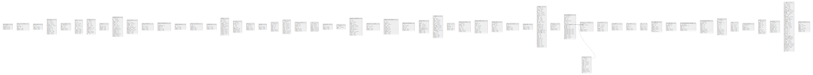

# meechoo

## Tables

| Name | Columns | Comment | Type |
| ---- | ------- | ------- | ---- |
| [accum_stats](accum_stats.md) | 4 |  | BASE TABLE |
| [admin_role_relations](admin_role_relations.md) | 5 |  | BASE TABLE |
| [admin_roles](admin_roles.md) | 4 |  | BASE TABLE |
| [admin_users](admin_users.md) | 12 |  | BASE TABLE |
| [article_pickup](article_pickup.md) | 5 |  | BASE TABLE |
| [banner](banner.md) | 11 |  | BASE TABLE |
| [birthdays](birthdays.md) | 12 |  | BASE TABLE |
| [categories](categories.md) | 5 |  | BASE TABLE |
| [characteristics](characteristics.md) | 16 |  | BASE TABLE |
| [content_authors](content_authors.md) | 11 |  | BASE TABLE |
| [content_categories](content_categories.md) | 5 |  | BASE TABLE |
| [content_ranking_details](content_ranking_details.md) | 6 |  | BASE TABLE |
| [content_rankings](content_rankings.md) | 4 |  | BASE TABLE |
| [content_tag_relations](content_tag_relations.md) | 5 |  | BASE TABLE |
| [content_tags](content_tags.md) | 4 |  | BASE TABLE |
| [contents](contents.md) | 14 |  | BASE TABLE |
| [daily_stats](daily_stats.md) | 9 |  | BASE TABLE |
| [favorites](favorites.md) | 5 |  | BASE TABLE |
| [feelings](feelings.md) | 4 |  | BASE TABLE |
| [gifts](gifts.md) | 7 |  | BASE TABLE |
| [inquiry](inquiry.md) | 11 |  | BASE TABLE |
| [inquiry_daily_stats](inquiry_daily_stats.md) | 7 |  | BASE TABLE |
| [jobs](jobs.md) | 7 |  | BASE TABLE |
| [lucky_colors](lucky_colors.md) | 4 |  | BASE TABLE |
| [migrations](migrations.md) | 3 |  | BASE TABLE |
| [newsletter_campaigns](newsletter_campaigns.md) | 14 |  | BASE TABLE |
| [newsletter_mail_groups](newsletter_mail_groups.md) | 5 |  | BASE TABLE |
| [newsletter_send_schedules](newsletter_send_schedules.md) | 12 |  | BASE TABLE |
| [newsletter_templates](newsletter_templates.md) | 6 |  | BASE TABLE |
| [partner_staffs](partner_staffs.md) | 10 |  | BASE TABLE |
| [partners](partners.md) | 18 |  | BASE TABLE |
| [pickup](pickup.md) | 5 |  | BASE TABLE |
| [product_daily_stats](product_daily_stats.md) | 8 |  | BASE TABLE |
| [product_manager_logs](product_manager_logs.md) | 10 |  | BASE TABLE |
| [product_memo](product_memo.md) | 8 |  | BASE TABLE |
| [product_tag_relations](product_tag_relations.md) | 5 |  | BASE TABLE |
| [product_tags](product_tags.md) | 4 |  | BASE TABLE |
| [products](products.md) | 34 |  | BASE TABLE |
| [rank_pickup](rank_pickup.md) | 5 |  | BASE TABLE |
| [result_enneagrams](result_enneagrams.md) | 20 |  | BASE TABLE |
| [sent_emails](sent_emails.md) | 13 |  | BASE TABLE |
| [sent_emails_url_clicked](sent_emails_url_clicked.md) | 7 |  | BASE TABLE |
| [sign_birthdays](sign_birthdays.md) | 7 |  | BASE TABLE |
| [sub_categories](sub_categories.md) | 5 |  | BASE TABLE |
| [tag_relations](tag_relations.md) | 5 |  | BASE TABLE |
| [tags](tags.md) | 5 |  | BASE TABLE |
| [talk_categories](talk_categories.md) | 8 |  | BASE TABLE |
| [talk_reactions](talk_reactions.md) | 6 |  | BASE TABLE |
| [talk_thread_comment_reactions](talk_thread_comment_reactions.md) | 6 |  | BASE TABLE |
| [talk_thread_comments](talk_thread_comments.md) | 10 |  | BASE TABLE |
| [talk_threads](talk_threads.md) | 13 |  | BASE TABLE |
| [theme](theme.md) | 7 |  | BASE TABLE |
| [ticket_attachments](ticket_attachments.md) | 5 |  | BASE TABLE |
| [tickets](tickets.md) | 11 |  | BASE TABLE |
| [user_deleted](user_deleted.md) | 9 |  | BASE TABLE |
| [users](users.md) | 41 |  | BASE TABLE |
| [warekim_birthdays](warekim_birthdays.md) | 8 |  | BASE TABLE |

## Relations

---

> Generated by [tbls](https://github.com/k1LoW/tbls)
