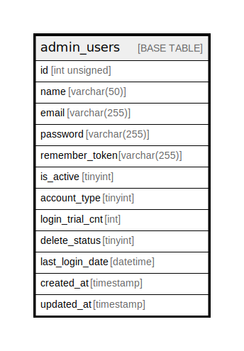

# admin_users

## Description

<details>
<summary><strong>Table Definition</strong></summary>

```sql
CREATE TABLE `admin_users` (
  `id` int unsigned NOT NULL AUTO_INCREMENT,
  `name` varchar(50) CHARACTER SET utf8mb4 COLLATE utf8mb4_unicode_ci DEFAULT NULL,
  `email` varchar(255) CHARACTER SET utf8mb4 COLLATE utf8mb4_unicode_ci NOT NULL,
  `password` varchar(255) CHARACTER SET utf8mb4 COLLATE utf8mb4_unicode_ci NOT NULL,
  `remember_token` varchar(255) CHARACTER SET utf8mb4 COLLATE utf8mb4_unicode_ci DEFAULT NULL,
  `is_active` tinyint NOT NULL DEFAULT '0',
  `account_type` tinyint DEFAULT NULL,
  `login_trial_cnt` int NOT NULL DEFAULT '0',
  `delete_status` tinyint NOT NULL DEFAULT '0',
  `last_login_date` datetime DEFAULT NULL,
  `created_at` timestamp NOT NULL DEFAULT CURRENT_TIMESTAMP,
  `updated_at` timestamp NULL DEFAULT NULL,
  PRIMARY KEY (`id`),
  UNIQUE KEY `admin_users_email_uindex` (`email`)
) ENGINE=InnoDB AUTO_INCREMENT=[Redacted by tbls] DEFAULT CHARSET=utf8mb4 COLLATE=utf8mb4_unicode_ci
```

</details>

## Columns

| Name | Type | Default | Nullable | Extra Definition | Children | Parents | Comment |
| ---- | ---- | ------- | -------- | ---------------- | -------- | ------- | ------- |
| id | int unsigned |  | false | auto_increment |  |  |  |
| name | varchar(50) |  | true |  |  |  |  |
| email | varchar(255) |  | false |  |  |  |  |
| password | varchar(255) |  | false |  |  |  |  |
| remember_token | varchar(255) |  | true |  |  |  |  |
| is_active | tinyint | 0 | false |  |  |  |  |
| account_type | tinyint |  | true |  |  |  |  |
| login_trial_cnt | int | 0 | false |  |  |  |  |
| delete_status | tinyint | 0 | false |  |  |  |  |
| last_login_date | datetime |  | true |  |  |  |  |
| created_at | timestamp | CURRENT_TIMESTAMP | false | DEFAULT_GENERATED |  |  |  |
| updated_at | timestamp |  | true |  |  |  |  |

## Constraints

| Name | Type | Definition |
| ---- | ---- | ---------- |
| admin_users_email_uindex | UNIQUE | UNIQUE KEY admin_users_email_uindex (email) |
| PRIMARY | PRIMARY KEY | PRIMARY KEY (id) |

## Indexes

| Name | Definition |
| ---- | ---------- |
| PRIMARY | PRIMARY KEY (id) USING BTREE |
| admin_users_email_uindex | UNIQUE KEY admin_users_email_uindex (email) USING BTREE |

## Relations



---

> Generated by [tbls](https://github.com/k1LoW/tbls)
