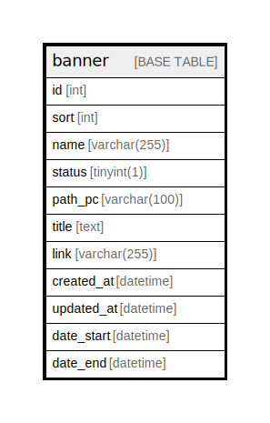

# banner

## Description

<details>
<summary><strong>Table Definition</strong></summary>

```sql
CREATE TABLE `banner` (
  `id` int NOT NULL AUTO_INCREMENT,
  `sort` int DEFAULT NULL,
  `name` varchar(255) CHARACTER SET utf8mb4 COLLATE utf8mb4_unicode_ci DEFAULT NULL,
  `status` tinyint(1) DEFAULT NULL,
  `path_pc` varchar(100) CHARACTER SET utf8mb4 COLLATE utf8mb4_unicode_ci DEFAULT NULL,
  `title` text CHARACTER SET utf8mb4 COLLATE utf8mb4_unicode_ci,
  `link` varchar(255) CHARACTER SET utf8mb4 COLLATE utf8mb4_unicode_ci DEFAULT NULL,
  `created_at` datetime DEFAULT NULL,
  `updated_at` datetime DEFAULT NULL,
  `date_start` datetime NOT NULL DEFAULT CURRENT_TIMESTAMP,
  `date_end` datetime NOT NULL DEFAULT CURRENT_TIMESTAMP,
  PRIMARY KEY (`id`)
) ENGINE=InnoDB AUTO_INCREMENT=[Redacted by tbls] DEFAULT CHARSET=utf8mb4 COLLATE=utf8mb4_unicode_ci
```

</details>

## Columns

| Name | Type | Default | Nullable | Extra Definition | Children | Parents | Comment |
| ---- | ---- | ------- | -------- | ---------------- | -------- | ------- | ------- |
| id | int |  | false | auto_increment |  |  |  |
| sort | int |  | true |  |  |  |  |
| name | varchar(255) |  | true |  |  |  |  |
| status | tinyint(1) |  | true |  |  |  |  |
| path_pc | varchar(100) |  | true |  |  |  |  |
| title | text |  | true |  |  |  |  |
| link | varchar(255) |  | true |  |  |  |  |
| created_at | datetime |  | true |  |  |  |  |
| updated_at | datetime |  | true |  |  |  |  |
| date_start | datetime | CURRENT_TIMESTAMP | false | DEFAULT_GENERATED |  |  |  |
| date_end | datetime | CURRENT_TIMESTAMP | false | DEFAULT_GENERATED |  |  |  |

## Constraints

| Name | Type | Definition |
| ---- | ---- | ---------- |
| PRIMARY | PRIMARY KEY | PRIMARY KEY (id) |

## Indexes

| Name | Definition |
| ---- | ---------- |
| PRIMARY | PRIMARY KEY (id) USING BTREE |

## Relations



---

> Generated by [tbls](https://github.com/k1LoW/tbls)
