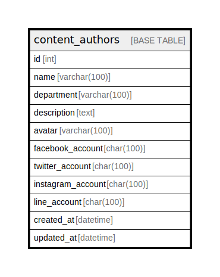

# content_authors

## Description

<details>
<summary><strong>Table Definition</strong></summary>

```sql
CREATE TABLE `content_authors` (
  `id` int NOT NULL AUTO_INCREMENT,
  `name` varchar(100) CHARACTER SET utf8mb4 COLLATE utf8mb4_unicode_ci NOT NULL,
  `department` varchar(100) CHARACTER SET utf8mb4 COLLATE utf8mb4_unicode_ci DEFAULT NULL,
  `description` text CHARACTER SET utf8mb4 COLLATE utf8mb4_unicode_ci,
  `avatar` varchar(100) CHARACTER SET utf8mb4 COLLATE utf8mb4_unicode_ci DEFAULT NULL,
  `facebook_account` char(100) CHARACTER SET utf8mb4 COLLATE utf8mb4_unicode_ci NOT NULL,
  `twitter_account` char(100) CHARACTER SET utf8mb4 COLLATE utf8mb4_unicode_ci NOT NULL,
  `instagram_account` char(100) CHARACTER SET utf8mb4 COLLATE utf8mb4_unicode_ci NOT NULL,
  `line_account` char(100) CHARACTER SET utf8mb4 COLLATE utf8mb4_unicode_ci NOT NULL,
  `created_at` datetime DEFAULT NULL,
  `updated_at` datetime DEFAULT NULL,
  PRIMARY KEY (`id`),
  UNIQUE KEY `content_authors_name_uindex` (`name`)
) ENGINE=InnoDB AUTO_INCREMENT=[Redacted by tbls] DEFAULT CHARSET=utf8mb4 COLLATE=utf8mb4_unicode_ci
```

</details>

## Columns

| Name | Type | Default | Nullable | Extra Definition | Children | Parents | Comment |
| ---- | ---- | ------- | -------- | ---------------- | -------- | ------- | ------- |
| id | int |  | false | auto_increment |  |  |  |
| name | varchar(100) |  | false |  |  |  |  |
| department | varchar(100) |  | true |  |  |  |  |
| description | text |  | true |  |  |  |  |
| avatar | varchar(100) |  | true |  |  |  |  |
| facebook_account | char(100) |  | false |  |  |  |  |
| twitter_account | char(100) |  | false |  |  |  |  |
| instagram_account | char(100) |  | false |  |  |  |  |
| line_account | char(100) |  | false |  |  |  |  |
| created_at | datetime |  | true |  |  |  |  |
| updated_at | datetime |  | true |  |  |  |  |

## Constraints

| Name | Type | Definition |
| ---- | ---- | ---------- |
| content_authors_name_uindex | UNIQUE | UNIQUE KEY content_authors_name_uindex (name) |
| PRIMARY | PRIMARY KEY | PRIMARY KEY (id) |

## Indexes

| Name | Definition |
| ---- | ---------- |
| PRIMARY | PRIMARY KEY (id) USING BTREE |
| content_authors_name_uindex | UNIQUE KEY content_authors_name_uindex (name) USING BTREE |

## Relations



---

> Generated by [tbls](https://github.com/k1LoW/tbls)
