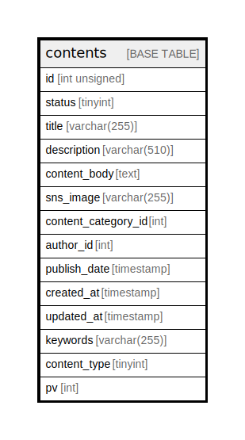

# contents

## Description

<details>
<summary><strong>Table Definition</strong></summary>

```sql
CREATE TABLE `contents` (
  `id` int unsigned NOT NULL AUTO_INCREMENT,
  `status` tinyint NOT NULL,
  `title` varchar(255) CHARACTER SET utf8mb4 COLLATE utf8mb4_unicode_ci NOT NULL,
  `description` varchar(510) CHARACTER SET utf8mb4 COLLATE utf8mb4_unicode_ci DEFAULT NULL,
  `content_body` text CHARACTER SET utf8mb4 COLLATE utf8mb4_unicode_ci,
  `sns_image` varchar(255) CHARACTER SET utf8mb4 COLLATE utf8mb4_unicode_ci DEFAULT NULL,
  `content_category_id` int DEFAULT NULL,
  `author_id` int DEFAULT NULL,
  `publish_date` timestamp NOT NULL DEFAULT CURRENT_TIMESTAMP,
  `created_at` timestamp NOT NULL DEFAULT CURRENT_TIMESTAMP,
  `updated_at` timestamp NULL DEFAULT NULL,
  `keywords` varchar(255) CHARACTER SET utf8mb4 COLLATE utf8mb4_unicode_ci DEFAULT NULL,
  `content_type` tinyint DEFAULT '0',
  `pv` int DEFAULT '0',
  PRIMARY KEY (`id`)
) ENGINE=InnoDB AUTO_INCREMENT=[Redacted by tbls] DEFAULT CHARSET=utf8mb4 COLLATE=utf8mb4_unicode_ci
```

</details>

## Columns

| Name | Type | Default | Nullable | Extra Definition | Children | Parents | Comment |
| ---- | ---- | ------- | -------- | ---------------- | -------- | ------- | ------- |
| id | int unsigned |  | false | auto_increment |  |  |  |
| status | tinyint |  | false |  |  |  |  |
| title | varchar(255) |  | false |  |  |  |  |
| description | varchar(510) |  | true |  |  |  |  |
| content_body | text |  | true |  |  |  |  |
| sns_image | varchar(255) |  | true |  |  |  |  |
| content_category_id | int |  | true |  |  |  |  |
| author_id | int |  | true |  |  |  |  |
| publish_date | timestamp | CURRENT_TIMESTAMP | false | DEFAULT_GENERATED |  |  |  |
| created_at | timestamp | CURRENT_TIMESTAMP | false | DEFAULT_GENERATED |  |  |  |
| updated_at | timestamp |  | true |  |  |  |  |
| keywords | varchar(255) |  | true |  |  |  |  |
| content_type | tinyint | 0 | true |  |  |  |  |
| pv | int | 0 | true |  |  |  |  |

## Constraints

| Name | Type | Definition |
| ---- | ---- | ---------- |
| PRIMARY | PRIMARY KEY | PRIMARY KEY (id) |

## Indexes

| Name | Definition |
| ---- | ---------- |
| PRIMARY | PRIMARY KEY (id) USING BTREE |

## Relations



---

> Generated by [tbls](https://github.com/k1LoW/tbls)
