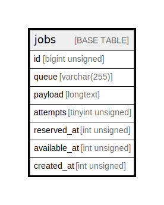

# jobs

## Description

<details>
<summary><strong>Table Definition</strong></summary>

```sql
CREATE TABLE `jobs` (
  `id` bigint unsigned NOT NULL AUTO_INCREMENT,
  `queue` varchar(255) CHARACTER SET utf8mb4 COLLATE utf8mb4_unicode_ci NOT NULL,
  `payload` longtext CHARACTER SET utf8mb4 COLLATE utf8mb4_unicode_ci NOT NULL,
  `attempts` tinyint unsigned NOT NULL,
  `reserved_at` int unsigned DEFAULT NULL,
  `available_at` int unsigned NOT NULL,
  `created_at` int unsigned NOT NULL,
  PRIMARY KEY (`id`),
  KEY `jobs_queue_index` (`queue`)
) ENGINE=InnoDB DEFAULT CHARSET=utf8mb4 COLLATE=utf8mb4_unicode_ci
```

</details>

## Columns

| Name | Type | Default | Nullable | Extra Definition | Children | Parents | Comment |
| ---- | ---- | ------- | -------- | ---------------- | -------- | ------- | ------- |
| id | bigint unsigned |  | false | auto_increment |  |  |  |
| queue | varchar(255) |  | false |  |  |  |  |
| payload | longtext |  | false |  |  |  |  |
| attempts | tinyint unsigned |  | false |  |  |  |  |
| reserved_at | int unsigned |  | true |  |  |  |  |
| available_at | int unsigned |  | false |  |  |  |  |
| created_at | int unsigned |  | false |  |  |  |  |

## Constraints

| Name | Type | Definition |
| ---- | ---- | ---------- |
| PRIMARY | PRIMARY KEY | PRIMARY KEY (id) |

## Indexes

| Name | Definition |
| ---- | ---------- |
| jobs_queue_index | KEY jobs_queue_index (queue) USING BTREE |
| PRIMARY | PRIMARY KEY (id) USING BTREE |

## Relations



---

> Generated by [tbls](https://github.com/k1LoW/tbls)
