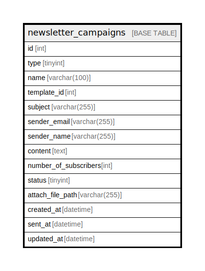

# newsletter_campaigns

## Description

<details>
<summary><strong>Table Definition</strong></summary>

```sql
CREATE TABLE `newsletter_campaigns` (
  `id` int NOT NULL AUTO_INCREMENT,
  `type` tinyint DEFAULT NULL,
  `name` varchar(100) CHARACTER SET utf8mb4 COLLATE utf8mb4_unicode_ci DEFAULT NULL,
  `template_id` int DEFAULT NULL,
  `subject` varchar(255) CHARACTER SET utf8mb4 COLLATE utf8mb4_unicode_ci DEFAULT NULL,
  `sender_email` varchar(255) CHARACTER SET utf8mb4 COLLATE utf8mb4_unicode_ci DEFAULT NULL,
  `sender_name` varchar(255) CHARACTER SET utf8mb4 COLLATE utf8mb4_unicode_ci DEFAULT NULL,
  `content` text CHARACTER SET utf8mb4 COLLATE utf8mb4_unicode_ci,
  `number_of_subscribers` int DEFAULT NULL,
  `status` tinyint DEFAULT NULL,
  `attach_file_path` varchar(255) CHARACTER SET utf8mb4 COLLATE utf8mb4_unicode_ci DEFAULT NULL,
  `created_at` datetime DEFAULT NULL,
  `sent_at` datetime DEFAULT NULL,
  `updated_at` datetime DEFAULT NULL,
  PRIMARY KEY (`id`)
) ENGINE=InnoDB AUTO_INCREMENT=[Redacted by tbls] DEFAULT CHARSET=utf8mb4 COLLATE=utf8mb4_unicode_ci
```

</details>

## Columns

| Name | Type | Default | Nullable | Extra Definition | Children | Parents | Comment |
| ---- | ---- | ------- | -------- | ---------------- | -------- | ------- | ------- |
| id | int |  | false | auto_increment |  |  |  |
| type | tinyint |  | true |  |  |  |  |
| name | varchar(100) |  | true |  |  |  |  |
| template_id | int |  | true |  |  |  |  |
| subject | varchar(255) |  | true |  |  |  |  |
| sender_email | varchar(255) |  | true |  |  |  |  |
| sender_name | varchar(255) |  | true |  |  |  |  |
| content | text |  | true |  |  |  |  |
| number_of_subscribers | int |  | true |  |  |  |  |
| status | tinyint |  | true |  |  |  |  |
| attach_file_path | varchar(255) |  | true |  |  |  |  |
| created_at | datetime |  | true |  |  |  |  |
| sent_at | datetime |  | true |  |  |  |  |
| updated_at | datetime |  | true |  |  |  |  |

## Constraints

| Name | Type | Definition |
| ---- | ---- | ---------- |
| PRIMARY | PRIMARY KEY | PRIMARY KEY (id) |

## Indexes

| Name | Definition |
| ---- | ---------- |
| PRIMARY | PRIMARY KEY (id) USING BTREE |

## Relations



---

> Generated by [tbls](https://github.com/k1LoW/tbls)
