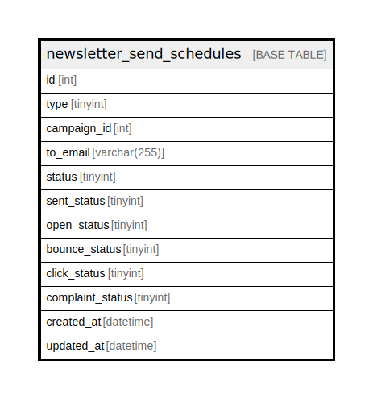

# newsletter_send_schedules

## Description

<details>
<summary><strong>Table Definition</strong></summary>

```sql
CREATE TABLE `newsletter_send_schedules` (
  `id` int NOT NULL AUTO_INCREMENT,
  `type` tinyint DEFAULT NULL,
  `campaign_id` int DEFAULT NULL,
  `to_email` varchar(255) CHARACTER SET utf8mb4 COLLATE utf8mb4_unicode_ci DEFAULT NULL,
  `status` tinyint DEFAULT NULL,
  `sent_status` tinyint DEFAULT '0',
  `open_status` tinyint DEFAULT '0',
  `bounce_status` tinyint DEFAULT '0',
  `click_status` tinyint DEFAULT '0',
  `complaint_status` tinyint DEFAULT '0',
  `created_at` datetime DEFAULT NULL,
  `updated_at` datetime DEFAULT NULL,
  PRIMARY KEY (`id`)
) ENGINE=InnoDB AUTO_INCREMENT=[Redacted by tbls] DEFAULT CHARSET=utf8mb4 COLLATE=utf8mb4_unicode_ci
```

</details>

## Columns

| Name | Type | Default | Nullable | Extra Definition | Children | Parents | Comment |
| ---- | ---- | ------- | -------- | ---------------- | -------- | ------- | ------- |
| id | int |  | false | auto_increment |  |  |  |
| type | tinyint |  | true |  |  |  |  |
| campaign_id | int |  | true |  |  |  |  |
| to_email | varchar(255) |  | true |  |  |  |  |
| status | tinyint |  | true |  |  |  |  |
| sent_status | tinyint | 0 | true |  |  |  |  |
| open_status | tinyint | 0 | true |  |  |  |  |
| bounce_status | tinyint | 0 | true |  |  |  |  |
| click_status | tinyint | 0 | true |  |  |  |  |
| complaint_status | tinyint | 0 | true |  |  |  |  |
| created_at | datetime |  | true |  |  |  |  |
| updated_at | datetime |  | true |  |  |  |  |

## Constraints

| Name | Type | Definition |
| ---- | ---- | ---------- |
| PRIMARY | PRIMARY KEY | PRIMARY KEY (id) |

## Indexes

| Name | Definition |
| ---- | ---------- |
| PRIMARY | PRIMARY KEY (id) USING BTREE |

## Relations



---

> Generated by [tbls](https://github.com/k1LoW/tbls)
