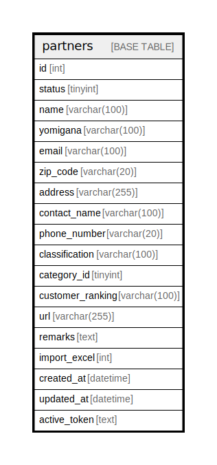

# partners

## Description

<details>
<summary><strong>Table Definition</strong></summary>

```sql
CREATE TABLE `partners` (
  `id` int NOT NULL AUTO_INCREMENT,
  `status` tinyint DEFAULT NULL,
  `name` varchar(100) CHARACTER SET utf8mb4 COLLATE utf8mb4_unicode_ci DEFAULT NULL,
  `yomigana` varchar(100) CHARACTER SET utf8mb4 COLLATE utf8mb4_unicode_ci DEFAULT NULL,
  `email` varchar(100) CHARACTER SET utf8mb4 COLLATE utf8mb4_unicode_ci DEFAULT NULL,
  `zip_code` varchar(20) CHARACTER SET utf8mb4 COLLATE utf8mb4_unicode_ci DEFAULT NULL,
  `address` varchar(255) CHARACTER SET utf8mb4 COLLATE utf8mb4_unicode_ci DEFAULT NULL,
  `contact_name` varchar(100) CHARACTER SET utf8mb4 COLLATE utf8mb4_unicode_ci DEFAULT NULL,
  `phone_number` varchar(20) CHARACTER SET utf8mb4 COLLATE utf8mb4_unicode_ci DEFAULT NULL,
  `classification` varchar(100) CHARACTER SET utf8mb4 COLLATE utf8mb4_unicode_ci DEFAULT NULL,
  `category_id` tinyint DEFAULT NULL,
  `customer_ranking` varchar(100) CHARACTER SET utf8mb4 COLLATE utf8mb4_unicode_ci DEFAULT NULL,
  `url` varchar(255) CHARACTER SET utf8mb4 COLLATE utf8mb4_unicode_ci DEFAULT NULL,
  `remarks` text CHARACTER SET utf8mb4 COLLATE utf8mb4_unicode_ci,
  `import_excel` int NOT NULL DEFAULT '0',
  `created_at` datetime DEFAULT NULL,
  `updated_at` datetime DEFAULT NULL,
  `active_token` text CHARACTER SET utf8mb4 COLLATE utf8mb4_unicode_ci,
  PRIMARY KEY (`id`)
) ENGINE=InnoDB AUTO_INCREMENT=[Redacted by tbls] DEFAULT CHARSET=utf8mb4 COLLATE=utf8mb4_unicode_ci
```

</details>

## Columns

| Name | Type | Default | Nullable | Extra Definition | Children | Parents | Comment |
| ---- | ---- | ------- | -------- | ---------------- | -------- | ------- | ------- |
| id | int |  | false | auto_increment |  |  |  |
| status | tinyint |  | true |  |  |  |  |
| name | varchar(100) |  | true |  |  |  |  |
| yomigana | varchar(100) |  | true |  |  |  |  |
| email | varchar(100) |  | true |  |  |  |  |
| zip_code | varchar(20) |  | true |  |  |  |  |
| address | varchar(255) |  | true |  |  |  |  |
| contact_name | varchar(100) |  | true |  |  |  |  |
| phone_number | varchar(20) |  | true |  |  |  |  |
| classification | varchar(100) |  | true |  |  |  |  |
| category_id | tinyint |  | true |  |  |  |  |
| customer_ranking | varchar(100) |  | true |  |  |  |  |
| url | varchar(255) |  | true |  |  |  |  |
| remarks | text |  | true |  |  |  |  |
| import_excel | int | 0 | false |  |  |  |  |
| created_at | datetime |  | true |  |  |  |  |
| updated_at | datetime |  | true |  |  |  |  |
| active_token | text |  | true |  |  |  |  |

## Constraints

| Name | Type | Definition |
| ---- | ---- | ---------- |
| PRIMARY | PRIMARY KEY | PRIMARY KEY (id) |

## Indexes

| Name | Definition |
| ---- | ---------- |
| PRIMARY | PRIMARY KEY (id) USING BTREE |

## Relations



---

> Generated by [tbls](https://github.com/k1LoW/tbls)
