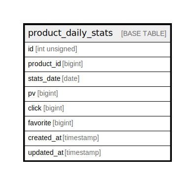

# product_daily_stats

## Description

<details>
<summary><strong>Table Definition</strong></summary>

```sql
CREATE TABLE `product_daily_stats` (
  `id` int unsigned NOT NULL AUTO_INCREMENT,
  `product_id` bigint NOT NULL DEFAULT '0',
  `stats_date` date NOT NULL,
  `pv` bigint NOT NULL DEFAULT '0',
  `click` bigint NOT NULL DEFAULT '0',
  `favorite` bigint NOT NULL DEFAULT '0',
  `created_at` timestamp NOT NULL DEFAULT CURRENT_TIMESTAMP,
  `updated_at` timestamp NULL DEFAULT NULL,
  PRIMARY KEY (`id`)
) ENGINE=InnoDB AUTO_INCREMENT=[Redacted by tbls] DEFAULT CHARSET=utf8mb4 COLLATE=utf8mb4_unicode_ci
```

</details>

## Columns

| Name | Type | Default | Nullable | Extra Definition | Children | Parents | Comment |
| ---- | ---- | ------- | -------- | ---------------- | -------- | ------- | ------- |
| id | int unsigned |  | false | auto_increment |  |  |  |
| product_id | bigint | 0 | false |  |  |  |  |
| stats_date | date |  | false |  |  |  |  |
| pv | bigint | 0 | false |  |  |  |  |
| click | bigint | 0 | false |  |  |  |  |
| favorite | bigint | 0 | false |  |  |  |  |
| created_at | timestamp | CURRENT_TIMESTAMP | false | DEFAULT_GENERATED |  |  |  |
| updated_at | timestamp |  | true |  |  |  |  |

## Constraints

| Name | Type | Definition |
| ---- | ---- | ---------- |
| PRIMARY | PRIMARY KEY | PRIMARY KEY (id) |

## Indexes

| Name | Definition |
| ---- | ---------- |
| PRIMARY | PRIMARY KEY (id) USING BTREE |

## Relations



---

> Generated by [tbls](https://github.com/k1LoW/tbls)
