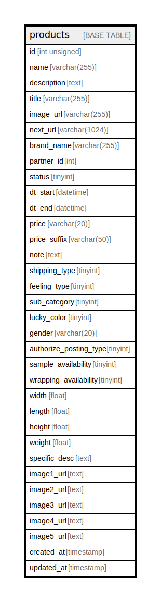

# products

## Description

<details>
<summary><strong>Table Definition</strong></summary>

```sql
CREATE TABLE `products` (
  `id` int unsigned NOT NULL AUTO_INCREMENT,
  `name` varchar(255) CHARACTER SET utf8mb4 COLLATE utf8mb4_unicode_ci NOT NULL,
  `description` text CHARACTER SET utf8mb4 COLLATE utf8mb4_unicode_ci,
  `title` varchar(255) CHARACTER SET utf8mb4 COLLATE utf8mb4_unicode_ci DEFAULT NULL,
  `image_url` varchar(255) CHARACTER SET utf8mb4 COLLATE utf8mb4_unicode_ci DEFAULT NULL,
  `next_url` varchar(1024) CHARACTER SET utf8mb4 COLLATE utf8mb4_unicode_ci DEFAULT NULL,
  `brand_name` varchar(255) CHARACTER SET utf8mb4 COLLATE utf8mb4_unicode_ci DEFAULT NULL,
  `partner_id` int DEFAULT NULL,
  `status` tinyint NOT NULL DEFAULT '0',
  `dt_start` datetime DEFAULT NULL,
  `dt_end` datetime DEFAULT NULL,
  `price` varchar(20) CHARACTER SET utf8mb4 COLLATE utf8mb4_unicode_ci DEFAULT NULL,
  `price_suffix` varchar(50) CHARACTER SET utf8mb4 COLLATE utf8mb4_unicode_ci DEFAULT NULL,
  `note` text CHARACTER SET utf8mb4 COLLATE utf8mb4_unicode_ci,
  `shipping_type` tinyint NOT NULL DEFAULT '0',
  `feeling_type` tinyint NOT NULL DEFAULT '0',
  `sub_category` tinyint NOT NULL DEFAULT '0',
  `lucky_color` tinyint NOT NULL DEFAULT '0',
  `gender` varchar(20) CHARACTER SET utf8mb4 COLLATE utf8mb4_unicode_ci DEFAULT '',
  `authorize_posting_type` tinyint DEFAULT '0',
  `sample_availability` tinyint DEFAULT '0',
  `wrapping_availability` tinyint DEFAULT '0',
  `width` float DEFAULT NULL,
  `length` float DEFAULT NULL,
  `height` float DEFAULT NULL,
  `weight` float DEFAULT NULL,
  `specific_desc` text CHARACTER SET utf8mb4 COLLATE utf8mb4_unicode_ci,
  `image1_url` text CHARACTER SET utf8mb4 COLLATE utf8mb4_unicode_ci,
  `image2_url` text CHARACTER SET utf8mb4 COLLATE utf8mb4_unicode_ci,
  `image3_url` text CHARACTER SET utf8mb4 COLLATE utf8mb4_unicode_ci,
  `image4_url` text CHARACTER SET utf8mb4 COLLATE utf8mb4_unicode_ci,
  `image5_url` text CHARACTER SET utf8mb4 COLLATE utf8mb4_unicode_ci,
  `created_at` timestamp NOT NULL DEFAULT CURRENT_TIMESTAMP,
  `updated_at` timestamp NULL DEFAULT NULL,
  PRIMARY KEY (`id`)
) ENGINE=InnoDB AUTO_INCREMENT=[Redacted by tbls] DEFAULT CHARSET=utf8mb4 COLLATE=utf8mb4_unicode_ci
```

</details>

## Columns

| Name | Type | Default | Nullable | Extra Definition | Children | Parents | Comment |
| ---- | ---- | ------- | -------- | ---------------- | -------- | ------- | ------- |
| id | int unsigned |  | false | auto_increment |  |  |  |
| name | varchar(255) |  | false |  |  |  |  |
| description | text |  | true |  |  |  |  |
| title | varchar(255) |  | true |  |  |  |  |
| image_url | varchar(255) |  | true |  |  |  |  |
| next_url | varchar(1024) |  | true |  |  |  |  |
| brand_name | varchar(255) |  | true |  |  |  |  |
| partner_id | int |  | true |  |  |  |  |
| status | tinyint | 0 | false |  |  |  |  |
| dt_start | datetime |  | true |  |  |  |  |
| dt_end | datetime |  | true |  |  |  |  |
| price | varchar(20) |  | true |  |  |  |  |
| price_suffix | varchar(50) |  | true |  |  |  |  |
| note | text |  | true |  |  |  |  |
| shipping_type | tinyint | 0 | false |  |  |  |  |
| feeling_type | tinyint | 0 | false |  |  |  |  |
| sub_category | tinyint | 0 | false |  |  |  |  |
| lucky_color | tinyint | 0 | false |  |  |  |  |
| gender | varchar(20) |  | true |  |  |  |  |
| authorize_posting_type | tinyint | 0 | true |  |  |  |  |
| sample_availability | tinyint | 0 | true |  |  |  |  |
| wrapping_availability | tinyint | 0 | true |  |  |  |  |
| width | float |  | true |  |  |  |  |
| length | float |  | true |  |  |  |  |
| height | float |  | true |  |  |  |  |
| weight | float |  | true |  |  |  |  |
| specific_desc | text |  | true |  |  |  |  |
| image1_url | text |  | true |  |  |  |  |
| image2_url | text |  | true |  |  |  |  |
| image3_url | text |  | true |  |  |  |  |
| image4_url | text |  | true |  |  |  |  |
| image5_url | text |  | true |  |  |  |  |
| created_at | timestamp | CURRENT_TIMESTAMP | false | DEFAULT_GENERATED |  |  |  |
| updated_at | timestamp |  | true |  |  |  |  |

## Constraints

| Name | Type | Definition |
| ---- | ---- | ---------- |
| PRIMARY | PRIMARY KEY | PRIMARY KEY (id) |

## Indexes

| Name | Definition |
| ---- | ---------- |
| PRIMARY | PRIMARY KEY (id) USING BTREE |

## Relations



---

> Generated by [tbls](https://github.com/k1LoW/tbls)
