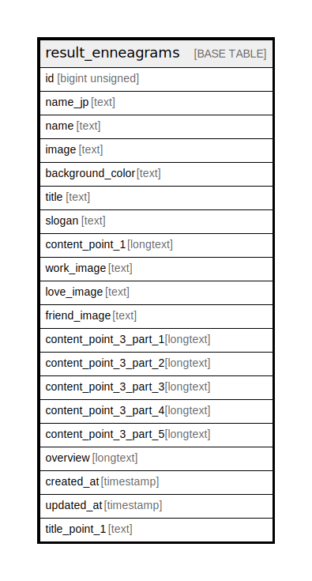

# result_enneagrams

## Description

<details>
<summary><strong>Table Definition</strong></summary>

```sql
CREATE TABLE `result_enneagrams` (
  `id` bigint unsigned NOT NULL AUTO_INCREMENT,
  `name_jp` text CHARACTER SET utf8mb4 COLLATE utf8mb4_unicode_ci,
  `name` text CHARACTER SET utf8mb4 COLLATE utf8mb4_unicode_ci,
  `image` text CHARACTER SET utf8mb4 COLLATE utf8mb4_unicode_ci,
  `background_color` text CHARACTER SET utf8mb4 COLLATE utf8mb4_unicode_ci,
  `title` text CHARACTER SET utf8mb4 COLLATE utf8mb4_unicode_ci,
  `slogan` text CHARACTER SET utf8mb4 COLLATE utf8mb4_unicode_ci,
  `content_point_1` longtext CHARACTER SET utf8mb4 COLLATE utf8mb4_unicode_ci,
  `work_image` text CHARACTER SET utf8mb4 COLLATE utf8mb4_unicode_ci,
  `love_image` text CHARACTER SET utf8mb4 COLLATE utf8mb4_unicode_ci,
  `friend_image` text CHARACTER SET utf8mb4 COLLATE utf8mb4_unicode_ci,
  `content_point_3_part_1` longtext CHARACTER SET utf8mb4 COLLATE utf8mb4_unicode_ci,
  `content_point_3_part_2` longtext CHARACTER SET utf8mb4 COLLATE utf8mb4_unicode_ci,
  `content_point_3_part_3` longtext CHARACTER SET utf8mb4 COLLATE utf8mb4_unicode_ci,
  `content_point_3_part_4` longtext CHARACTER SET utf8mb4 COLLATE utf8mb4_unicode_ci,
  `content_point_3_part_5` longtext CHARACTER SET utf8mb4 COLLATE utf8mb4_unicode_ci,
  `overview` longtext CHARACTER SET utf8mb4 COLLATE utf8mb4_unicode_ci,
  `created_at` timestamp NULL DEFAULT NULL,
  `updated_at` timestamp NULL DEFAULT NULL,
  `title_point_1` text CHARACTER SET utf8mb4 COLLATE utf8mb4_unicode_ci,
  PRIMARY KEY (`id`)
) ENGINE=InnoDB AUTO_INCREMENT=[Redacted by tbls] DEFAULT CHARSET=utf8mb4 COLLATE=utf8mb4_unicode_ci
```

</details>

## Columns

| Name | Type | Default | Nullable | Extra Definition | Children | Parents | Comment |
| ---- | ---- | ------- | -------- | ---------------- | -------- | ------- | ------- |
| id | bigint unsigned |  | false | auto_increment |  |  |  |
| name_jp | text |  | true |  |  |  |  |
| name | text |  | true |  |  |  |  |
| image | text |  | true |  |  |  |  |
| background_color | text |  | true |  |  |  |  |
| title | text |  | true |  |  |  |  |
| slogan | text |  | true |  |  |  |  |
| content_point_1 | longtext |  | true |  |  |  |  |
| work_image | text |  | true |  |  |  |  |
| love_image | text |  | true |  |  |  |  |
| friend_image | text |  | true |  |  |  |  |
| content_point_3_part_1 | longtext |  | true |  |  |  |  |
| content_point_3_part_2 | longtext |  | true |  |  |  |  |
| content_point_3_part_3 | longtext |  | true |  |  |  |  |
| content_point_3_part_4 | longtext |  | true |  |  |  |  |
| content_point_3_part_5 | longtext |  | true |  |  |  |  |
| overview | longtext |  | true |  |  |  |  |
| created_at | timestamp |  | true |  |  |  |  |
| updated_at | timestamp |  | true |  |  |  |  |
| title_point_1 | text |  | true |  |  |  |  |

## Constraints

| Name | Type | Definition |
| ---- | ---- | ---------- |
| PRIMARY | PRIMARY KEY | PRIMARY KEY (id) |

## Indexes

| Name | Definition |
| ---- | ---------- |
| PRIMARY | PRIMARY KEY (id) USING BTREE |

## Relations



---

> Generated by [tbls](https://github.com/k1LoW/tbls)
