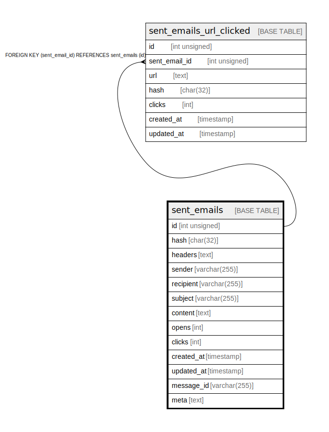

# sent_emails

## Description

<details>
<summary><strong>Table Definition</strong></summary>

```sql
CREATE TABLE `sent_emails` (
  `id` int unsigned NOT NULL AUTO_INCREMENT,
  `hash` char(32) CHARACTER SET utf8mb4 COLLATE utf8mb4_unicode_ci NOT NULL,
  `headers` text CHARACTER SET utf8mb4 COLLATE utf8mb4_unicode_ci,
  `sender` varchar(255) CHARACTER SET utf8mb4 COLLATE utf8mb4_unicode_ci DEFAULT NULL,
  `recipient` varchar(255) CHARACTER SET utf8mb4 COLLATE utf8mb4_unicode_ci DEFAULT NULL,
  `subject` varchar(255) CHARACTER SET utf8mb4 COLLATE utf8mb4_unicode_ci DEFAULT NULL,
  `content` text CHARACTER SET utf8mb4 COLLATE utf8mb4_unicode_ci,
  `opens` int DEFAULT NULL,
  `clicks` int DEFAULT NULL,
  `created_at` timestamp NULL DEFAULT NULL,
  `updated_at` timestamp NULL DEFAULT NULL,
  `message_id` varchar(255) CHARACTER SET utf8mb4 COLLATE utf8mb4_unicode_ci DEFAULT NULL,
  `meta` text CHARACTER SET utf8mb4 COLLATE utf8mb4_unicode_ci,
  PRIMARY KEY (`id`),
  UNIQUE KEY `sent_emails_hash_unique` (`hash`),
  KEY `sent_emails_message_id_index` (`message_id`)
) ENGINE=InnoDB AUTO_INCREMENT=[Redacted by tbls] DEFAULT CHARSET=utf8mb4 COLLATE=utf8mb4_unicode_ci
```

</details>

## Columns

| Name | Type | Default | Nullable | Extra Definition | Children | Parents | Comment |
| ---- | ---- | ------- | -------- | ---------------- | -------- | ------- | ------- |
| id | int unsigned |  | false | auto_increment | [sent_emails_url_clicked](sent_emails_url_clicked.md) |  |  |
| hash | char(32) |  | false |  |  |  |  |
| headers | text |  | true |  |  |  |  |
| sender | varchar(255) |  | true |  |  |  |  |
| recipient | varchar(255) |  | true |  |  |  |  |
| subject | varchar(255) |  | true |  |  |  |  |
| content | text |  | true |  |  |  |  |
| opens | int |  | true |  |  |  |  |
| clicks | int |  | true |  |  |  |  |
| created_at | timestamp |  | true |  |  |  |  |
| updated_at | timestamp |  | true |  |  |  |  |
| message_id | varchar(255) |  | true |  |  |  |  |
| meta | text |  | true |  |  |  |  |

## Constraints

| Name | Type | Definition |
| ---- | ---- | ---------- |
| PRIMARY | PRIMARY KEY | PRIMARY KEY (id) |
| sent_emails_hash_unique | UNIQUE | UNIQUE KEY sent_emails_hash_unique (hash) |

## Indexes

| Name | Definition |
| ---- | ---------- |
| sent_emails_message_id_index | KEY sent_emails_message_id_index (message_id) USING BTREE |
| PRIMARY | PRIMARY KEY (id) USING BTREE |
| sent_emails_hash_unique | UNIQUE KEY sent_emails_hash_unique (hash) USING BTREE |

## Relations



---

> Generated by [tbls](https://github.com/k1LoW/tbls)
