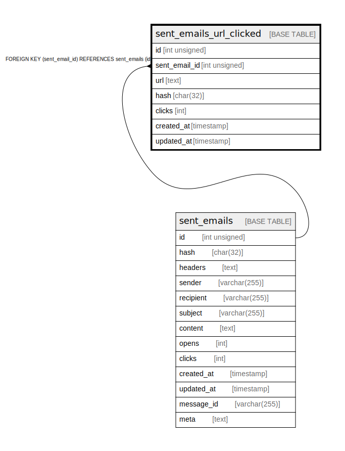

# sent_emails_url_clicked

## Description

<details>
<summary><strong>Table Definition</strong></summary>

```sql
CREATE TABLE `sent_emails_url_clicked` (
  `id` int unsigned NOT NULL AUTO_INCREMENT,
  `sent_email_id` int unsigned NOT NULL,
  `url` text CHARACTER SET utf8mb4 COLLATE utf8mb4_unicode_ci,
  `hash` char(32) CHARACTER SET utf8mb4 COLLATE utf8mb4_unicode_ci NOT NULL,
  `clicks` int NOT NULL DEFAULT '1',
  `created_at` timestamp NULL DEFAULT NULL,
  `updated_at` timestamp NULL DEFAULT NULL,
  PRIMARY KEY (`id`),
  KEY `sent_emails_url_clicked_sent_email_id_foreign` (`sent_email_id`),
  CONSTRAINT `sent_emails_url_clicked_sent_email_id_foreign` FOREIGN KEY (`sent_email_id`) REFERENCES `sent_emails` (`id`) ON DELETE CASCADE
) ENGINE=InnoDB AUTO_INCREMENT=[Redacted by tbls] DEFAULT CHARSET=utf8mb4 COLLATE=utf8mb4_unicode_ci
```

</details>

## Columns

| Name | Type | Default | Nullable | Extra Definition | Children | Parents | Comment |
| ---- | ---- | ------- | -------- | ---------------- | -------- | ------- | ------- |
| id | int unsigned |  | false | auto_increment |  |  |  |
| sent_email_id | int unsigned |  | false |  |  | [sent_emails](sent_emails.md) |  |
| url | text |  | true |  |  |  |  |
| hash | char(32) |  | false |  |  |  |  |
| clicks | int | 1 | false |  |  |  |  |
| created_at | timestamp |  | true |  |  |  |  |
| updated_at | timestamp |  | true |  |  |  |  |

## Constraints

| Name | Type | Definition |
| ---- | ---- | ---------- |
| PRIMARY | PRIMARY KEY | PRIMARY KEY (id) |
| sent_emails_url_clicked_sent_email_id_foreign | FOREIGN KEY | FOREIGN KEY (sent_email_id) REFERENCES sent_emails (id) |

## Indexes

| Name | Definition |
| ---- | ---------- |
| sent_emails_url_clicked_sent_email_id_foreign | KEY sent_emails_url_clicked_sent_email_id_foreign (sent_email_id) USING BTREE |
| PRIMARY | PRIMARY KEY (id) USING BTREE |

## Relations



---

> Generated by [tbls](https://github.com/k1LoW/tbls)
