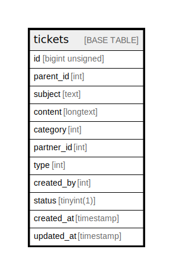

# tickets

## Description

<details>
<summary><strong>Table Definition</strong></summary>

```sql
CREATE TABLE `tickets` (
  `id` bigint unsigned NOT NULL AUTO_INCREMENT,
  `parent_id` int DEFAULT NULL,
  `subject` text CHARACTER SET utf8mb4 COLLATE utf8mb4_unicode_ci,
  `content` longtext CHARACTER SET utf8mb4 COLLATE utf8mb4_unicode_ci,
  `category` int DEFAULT NULL,
  `partner_id` int DEFAULT NULL,
  `type` int DEFAULT NULL,
  `created_by` int NOT NULL,
  `status` tinyint(1) NOT NULL DEFAULT '1',
  `created_at` timestamp NULL DEFAULT NULL,
  `updated_at` timestamp NULL DEFAULT NULL,
  PRIMARY KEY (`id`)
) ENGINE=InnoDB DEFAULT CHARSET=utf8mb4 COLLATE=utf8mb4_unicode_ci
```

</details>

## Columns

| Name | Type | Default | Nullable | Extra Definition | Children | Parents | Comment |
| ---- | ---- | ------- | -------- | ---------------- | -------- | ------- | ------- |
| id | bigint unsigned |  | false | auto_increment |  |  |  |
| parent_id | int |  | true |  |  |  |  |
| subject | text |  | true |  |  |  |  |
| content | longtext |  | true |  |  |  |  |
| category | int |  | true |  |  |  |  |
| partner_id | int |  | true |  |  |  |  |
| type | int |  | true |  |  |  |  |
| created_by | int |  | false |  |  |  |  |
| status | tinyint(1) | 1 | false |  |  |  |  |
| created_at | timestamp |  | true |  |  |  |  |
| updated_at | timestamp |  | true |  |  |  |  |

## Constraints

| Name | Type | Definition |
| ---- | ---- | ---------- |
| PRIMARY | PRIMARY KEY | PRIMARY KEY (id) |

## Indexes

| Name | Definition |
| ---- | ---------- |
| PRIMARY | PRIMARY KEY (id) USING BTREE |

## Relations



---

> Generated by [tbls](https://github.com/k1LoW/tbls)
