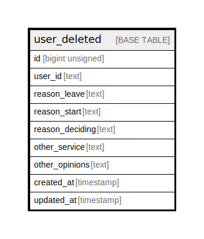

# user_deleted

## Description

<details>
<summary><strong>Table Definition</strong></summary>

```sql
CREATE TABLE `user_deleted` (
  `id` bigint unsigned NOT NULL AUTO_INCREMENT,
  `user_id` text CHARACTER SET utf8mb4 COLLATE utf8mb4_unicode_ci,
  `reason_leave` text CHARACTER SET utf8mb4 COLLATE utf8mb4_unicode_ci,
  `reason_start` text CHARACTER SET utf8mb4 COLLATE utf8mb4_unicode_ci,
  `reason_deciding` text CHARACTER SET utf8mb4 COLLATE utf8mb4_unicode_ci,
  `other_service` text CHARACTER SET utf8mb4 COLLATE utf8mb4_unicode_ci,
  `other_opinions` text CHARACTER SET utf8mb4 COLLATE utf8mb4_unicode_ci,
  `created_at` timestamp NULL DEFAULT NULL,
  `updated_at` timestamp NULL DEFAULT NULL,
  PRIMARY KEY (`id`)
) ENGINE=InnoDB AUTO_INCREMENT=[Redacted by tbls] DEFAULT CHARSET=utf8mb4 COLLATE=utf8mb4_unicode_ci
```

</details>

## Columns

| Name | Type | Default | Nullable | Extra Definition | Children | Parents | Comment |
| ---- | ---- | ------- | -------- | ---------------- | -------- | ------- | ------- |
| id | bigint unsigned |  | false | auto_increment |  |  |  |
| user_id | text |  | true |  |  |  |  |
| reason_leave | text |  | true |  |  |  |  |
| reason_start | text |  | true |  |  |  |  |
| reason_deciding | text |  | true |  |  |  |  |
| other_service | text |  | true |  |  |  |  |
| other_opinions | text |  | true |  |  |  |  |
| created_at | timestamp |  | true |  |  |  |  |
| updated_at | timestamp |  | true |  |  |  |  |

## Constraints

| Name | Type | Definition |
| ---- | ---- | ---------- |
| PRIMARY | PRIMARY KEY | PRIMARY KEY (id) |

## Indexes

| Name | Definition |
| ---- | ---------- |
| PRIMARY | PRIMARY KEY (id) USING BTREE |

## Relations



---

> Generated by [tbls](https://github.com/k1LoW/tbls)
